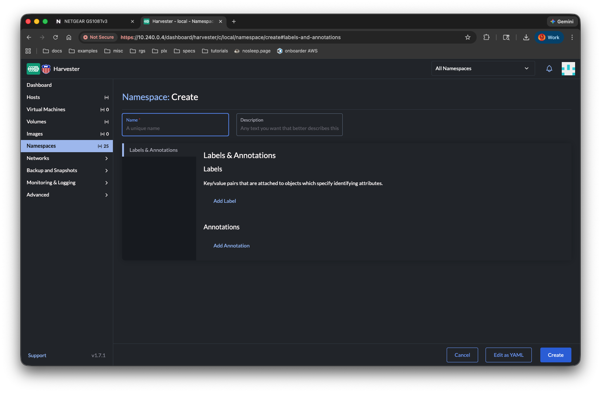
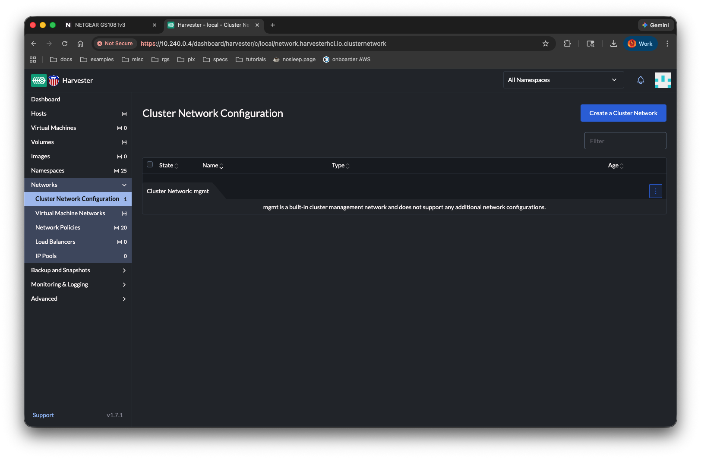
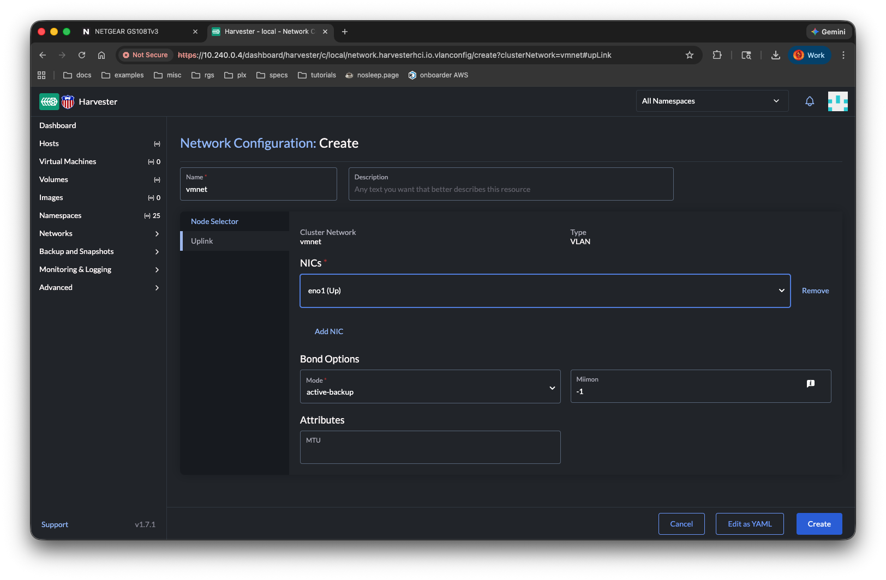
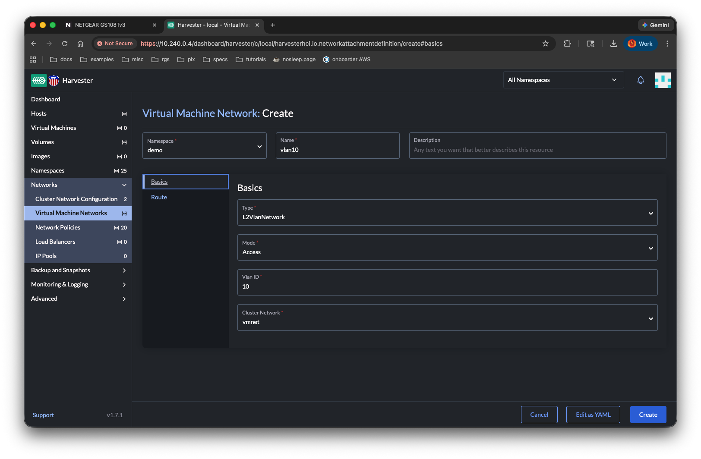
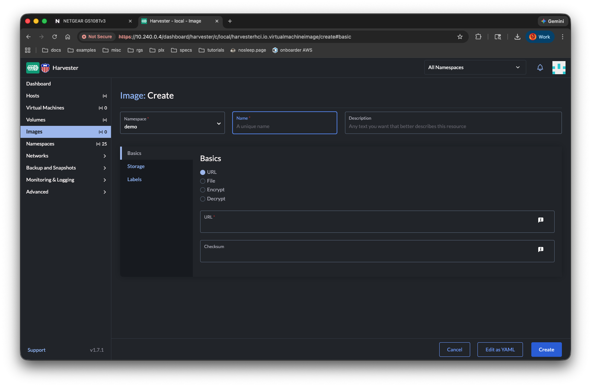
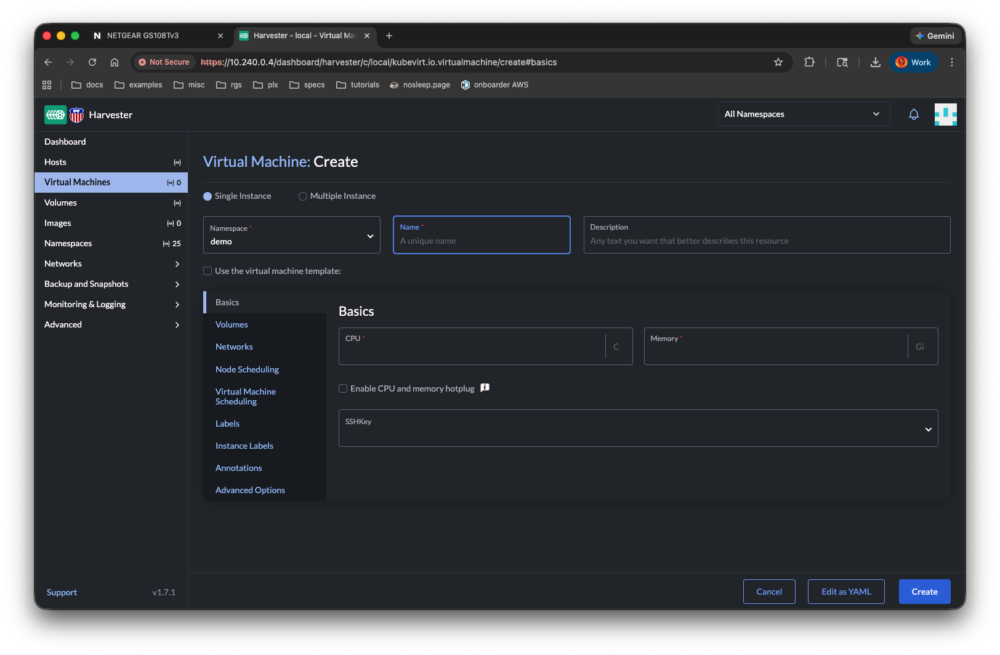

# Harvester

## Initial Setup

### Download kubeconfig


Save as "$HOME/harvester-edgelab.yaml"

```console
$ yq "$HOME/harvester-edgelab.yaml"
apiVersion: v1
kind: Config
clusters:
  - name: "local"
    cluster:
      server: "https://10.240.0.4/k8s/clusters/local"
      certificate-authority-data: "LS0tLS1CRUdJTiBDRVJUSUZJQ0FURS0tLS0tCk1JSUJ2akNDQVdPZ0F3SUJBZ0lCQURBS0JnZ3Foa2pPUFFRREFqQkdNUnd3R2dZRFZRUUtFeE5rZVc1aGJXbGoKYkdsemRHVnVaWEl0YjNKbk1TWXdKQVlEVlFRRERCMWtlVzVoYldsamJHbHpkR1Z1WlhJdFkyRkFNVGMzTVRJMQpPVGs1TXpBZUZ3MHlOakF5TVRZeE5UTTVOVE5hRncwek5qQXlNVFF4TlRNNU5UTmFNRVl4SERBYUJnTlZCQW9UCkUyUjVibUZ0YVdOc2FYTjBaVzVsY2kxdmNtY3hKakFrQmdOVkJBTU1IV1I1Ym1GdGFXTnNhWE4wWlc1bGNpMWoKWVVBeE56Y3hNalU1T1Rrek1Ga3dFd1lIS29aSXpqMENBUVlJS29aSXpqMERBUWNEUWdBRVBUaHpYS1ViVTZVdwpvMkVGODN5WlYwZmY4OTNQdGQyUjFubzltYUNsS3NOa2xwaUNaSVpyVHozUExWN1MwSHdEa0psaDZwVE55M09rCjBNd0FLNlJpZDZOQ01FQXdEZ1lEVlIwUEFRSC9CQVFEQWdLa01BOEdBMVVkRXdFQi93UUZNQU1CQWY4d0hRWUQKVlIwT0JCWUVGQzlSa2dzekRWdEZqRVF5cktHTUtOQWVZcTVYTUFvR0NDcUdTTTQ5QkFNQ0Ewa0FNRVlDSVFDOQpVMjlsOHI3dTNPUWxqdlA4M01TTzAzakpobkg4c3lIdGdsZ0V1b2lXcUFJaEFQdTNLRXZ5Znl4bklZOERYVkM0Cm93eUFxdmlBakdiSjZlZ2J6ajBMSUhqTgotLS0tLUVORCBDRVJUSUZJQ0FURS0tLS0t"
users:
  - name: "local"
    user:
      token: <REDACTED>
contexts:
  - name: "local"
    context:
      user: "local"
      cluster: "local"
current-context: "local"
```

### Create namespace for demo

### Using the UI



### Kubernetes API

```sh
kubectl create -f manifests/namespace.yaml
```

## Network Setup

[Upstream Documentation](https://docs.harvesterhci.io/v1.7/networking/index/)

### Using the UI







### Kubernetes API

```sh
kubectl create -f manifests/network.yaml
```

## Create VMs

[Upstream Documentation](https://docs.harvesterhci.io/v1.7/vm/index)

### Using the UI

#### Acquire the OS image



#### Create Virtual Machine



### Kubernetes API

```sh
kubectl create -f manifests/opensuse-leap-image.yaml
kubectl wait --for=condition=Imported -n demo virtualmachineimages/opensuse-leap-15-6
```

```sh
kubectl create -f manifests/suse-vlan10.yaml
kubectl create -f manifests/suse-vlan20.yaml
```

## Import from OVA

```sh
kubectl create -f manifests/ubuntu-import.yaml
kubectl logs -n harvester-system -l app.kubernetes.io/name=harvester-vm-import-controller -f
```

## Cleanup

```sh
kubectl delete virtualmachines -n demo --all
kubectl delete pvc -n demo --all
kubectl delete secret -n demo --all
kubectl delete virtualmachineimage -n demo --all
kubectl delete network-attachment-definitions -n demo --all
kubectl delete ns demo
kubectl delete vlanconfig vmnet
kubectl delete clusternetwork vmnet
```
